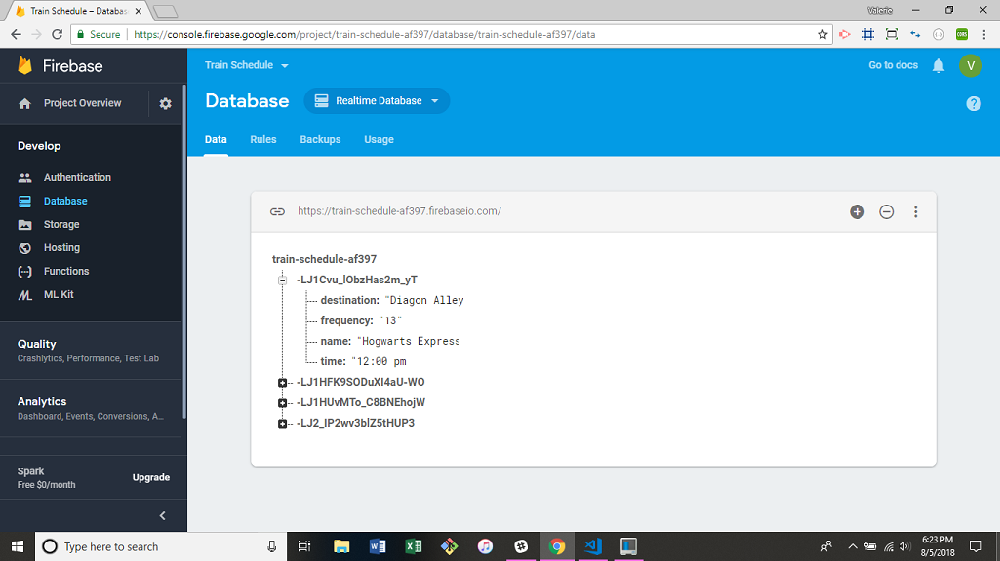

# TrainSchedule
This project shows an imaginary train schedule that will calculate what time the next train will arrive at the station and how much time (in minutes) from the current time will pass before the next train arrives.  Users may also add their own train to the schedule that will remain, even when the user logs out of the browser.

## Getting Started
In order to access the train schedule, please click the following link:
https://valeriemiller5.github.io/TrainSchedule/

This website was created using Firebase to capture the user's input and store in a database.  All forms submitted through the website will be stored in the database and appear each time the user visits the site.

## Built With
jQuery - Javascript library used on this project
Bootstrap - CSS library used on this project
Firebase - database used to store user's data

## Authors
Valerie Flores - Initial work

## License
This project is licensed under the MIT License - see the LICENSE.md file for details

## Acknowledgments
Thank you for the tips from class mates, instructor, and those who have posted hints and solutions online.